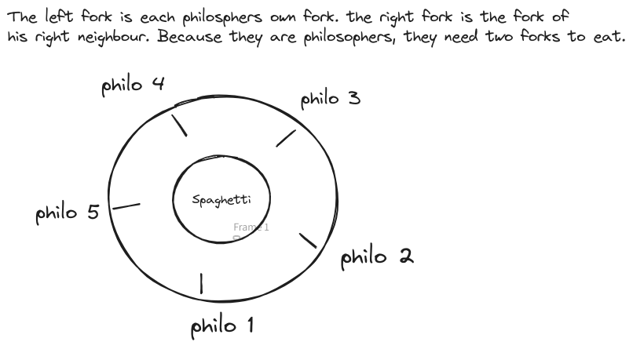

# Philosophers

- [Philosophers](#philosophers)
  - [Introduction](#introduction)
  - [Problem statement](#problem-statement)
  - [Concepts](#concepts)
    - [Threads](#threads)
    - [Data races](#data-races)
    - [Mutexes](#mutexes)
    - [Deadlocks](#deadlocks)
    - [Atomic operations](#atomic-operations)
    - [Starvation](#starvation)
      - [Even number of philosophers](#even-number-of-philosophers)
      - [Odd number of philosophers](#odd-number-of-philosophers)
  - [Thread Termination and Resource Cleanup](#thread-termination-and-resource-cleanup)
  - [Ending Threads and Cleanup](#ending-threads-and-cleanup)
    - [Ending Threads](#ending-threads)
    - [Destroying mutexes](#destroying-mutexes)
  - [Testing](#testing)
  - [Difference between pthread\_detach and pthread\_join](#difference-between-pthread_detach-and-pthread_join)
  - [Functions](#functions)

## Introduction
This project is the [42 school](https://42.fr/en/homepage/) implementation the famous Dining Philosophers problem, a classic synchronization problem in computer science. It was first introduced by Edsger Dijkstra in 1965 and is a representation of a scenario where multiple processes (threads) need to access shared resources (forks) in a synchronized manner. The goal is to avoid deadlocks, data races, and starvation, ensuring that all philosophers can eat, sleep and think without dying (from starvation).




## Problem statement
You can find the full instructions [here](philo.pdf)
- One or more philosophers sit at a round table.
  There is a large bowl of spaghetti in the middle of the table.
- The philosophers alternatively eat, think, or sleep.
  While they are eating, they are not thinking nor sleeping;
  while thinking, they are not eating nor sleeping;
  and, of course, while sleeping, they are not eating nor thinking.
- There are also forks on the table. There are as many forks as philosophers.
- Because serving and eating spaghetti with only one fork is very inconvenient, a
  philosopher takes their right and their left forks to eat, one in each hand.
- When a philosopher has finished eating, they put their forks back on the table and
  start sleeping. Once awake, they start thinking again. The simulation stops when
  a philosopher dies of starvation.
- Every philosopher needs to eat and should never starve.
- Philosophers don't speak with each other.
- Philosophers don't know if another philosopher is about to die.
- No need to say that philosophers should avoid dying!
- According to the evaluation sheet, no  values lower than 60 ms are allowed for t_die, t_eat, t_sleep and no more than 200 Philosphers

## Concepts

### Threads
In the context of this project, we utilize threads. A thread, often termed as a lightweight process, is a path of execution within a process. When a thread is created, it runs code concurrently with the main code and other threads. This concurrent execution allows for tasks to be performed simultaneously, improving the efficiency and performance of the program.

The key difference between threads and processes lies in their memory space. Threads within the same process share the same memory space, which means they can access the same variables and data structures. This shared memory model allows for faster communication between threads as there's no need for inter-process communication (like pipes), which is required in a multi-process model. However, this also means that care must be taken to avoid problems such as [data races](#data-races), where multiple threads attempt to read and write to the same memory location.

Threads are faster to create and destroy compared to processes, and they require less overhead, making them a suitable choice for tasks that are relatively small or need to share a significant amount of data with other tasks. However, programming with threads can be complex due to the need for synchronization mechanisms (like [mutexes](#mutexes) or semaphores) to prevent data inconsistencies and other concurrency-related issues.

In the context of this Dining Philosophers problem, each philosopher should be represented by a thread. The actions of eating, thinking, and sleeping will be different states in the life cycle of these threads.

### Data races
A data race occurs when two or more threads access the same memory location concurrently, and at least one of the accesses is for writing, and the threads are not using any mechanism to synchronize their accesses to that memory. This can lead to inconsistent and unpredictable results. To avoid this, we need a way of synchronizing the threads for critical parts of our program (the read and write parts) like mutexes or semaphores.
Mutexes help us avoid this problem by ensuring that only one thread can access the shared data at a time.

### Mutexes

Mutexes, short for mutual exclusion, are used to prevent data races in multi-threaded programming. They ensure that only one thread can access shared data at a time.  
Consider a scenario where one thread writes to a shared variable and another thread reads this variable. Both threads must acquire (lock) the mutex before they can access the variable to ensure that they do not attempt to read and write the data simultaneously.

- **Creation**: A mutex is created as a variable of type `pthread_mutex_t`. This variable will then be used as the mutex.

- **Initialization**: After creation, a mutex is initialized using the `pthread_mutex_init` function. This function prepares the mutex for use.

- **Locking and Unlocking**: Before a thread can read or write shared data, it must acquire (or lock) the mutex using the `pthread_mutex_lock` function. Once the thread has finished with the data, it should release (or unlock) the mutex using the `pthread_mutex_unlock` function. This allows other threads to acquire the mutex and access the data.

- **Destruction**: When a mutex is no longer needed, it should be destroyed (or freed) using the `pthread_mutex_destroy` function. This releases the resources that were allocated to the mutex.

When working with multiple mutexes, it's important to carefully consider the order in which threads lock the mutexes. If not handled correctly, this can lead to a situation known as a [deadlock](#deadlocks), where two or more threads are each waiting for the other to release a mutex, resulting in all of them being stuck.

### Deadlocks
A Deadlock occurs when two or more threads are unable to proceed because each is waiting for the other to release a resource (mutex). For example, in the Dining Philosophers problem, a deadlock could occur if each philosopher picks up his left fork (mutex) and then waits to pick up his right fork. But his right fork is another philosphers left fork. So they are all stuck and the program is not moving forward.

### Atomic operations
Atomic operations in the context of multithreading are operations that are completed in a single step without the possibility of being interrupted. When an atomic operation starts, it is guaranteed to finish without any thread being able to access the operation data until it has fully completed.  
This is crucial in preventing race conditions, where the output is dependent on the sequence or timing of other uncontrollable events.  

Example:  
It is not enough, to check if the simulation should end in a threadsafe manner, and then afterwards do some operation like eating or sleeping. This is because after we checked the value and before executing the action, the value can have changed. For this reason we need to perform the whole action within the locked mutex or mutexes if we need to check several values for our operation, like if the philosopher is still alive and the simulation should still run.

### Starvation

In the context of the Dining Philosophers problem, starvation means, that a philospher repeatedly loses out his turn on eating because other philosphers (threads) are faster to pick up the forks.
To prevent this, we have to implement a mechanism to make the system fair and ensure that each philosopher gets an equal opportunity to eat, thereby preventing starvation. This means that each philosopher should be able to eat the same number of times.

Example of unfair scenario with three philosophers:

1. Philosopher 1 starts eating.
2. Once Philosopher 1 finishes, Philosopher 2 starts eating.
3. After Philosopher 2 finishes, Philosopher 1 starts eating again
4. Philosopher 3 potentially dies of starvation

Depending on the time values set and the number of philosphers, the system can be fair by default. With other values, we need to implement a thinking period.

#### Even number of philosophers
In a scenario with an even number of philosophers, our system is inherently fair. This is because the tester of our program should not use time values lower than 60ms. This ensures, there is a mandatory sleeping period of at least 60 ms after each eating session. While half of the philosophers are eating, the other half are either sleeping or waiting, depending on  the used time values. But they will always have at least 60 ms headstart over the philospohers, that just ate.
| philo | time | action | duration |
|-------|------|--------|----------|
| 2     | 0ms  | eat    | 200ms    |
| 1     | 0ms  | wait   | 200ms    |
| 2     | 200ms| sleep  | 60ms     |
| 1     | 200ms| eat    | 200ms    |
| 2     | 260ms| wait   | 140ms    |
| 1     | 400ms| sleep  | 60ms     |
| 2     | 400ms| eat    | 200ms    |

#### Odd number of philosophers
In a scenario with an odd number of philosophers, the fairness mechanism is slightly more complex. In the first cycle, all the even-indexed philosophers eat. In the second cycle, all the odd-indexed philosophers eat, except for one, due to the shortage of forks. This remaining philosopher has to wait until the third cycle to eat. However, by this time, the philosophers from the first cycle may have completed their entire routine (if there's no thinking period implemented) and be ready to pick up the forks as soon as they become available. To prevent any philosopher from repeatedly missing out on eating, we implement a thinking period. This period bridges the time gap and ensures that every philosopher gets a chance to eat in each full cycle.
The thinking time for odd philosopher is calculated as followed:  
```c
if (2 * t_eat > t_sleep) {
  t_think = 2 * t_eat - t_sleep;
}
```
## Thread Termination and Resource Cleanup

Mutexes, used in multi-threaded programming for safe access to shared resources, are dynamically allocated in memory. Proper management of these resources is crucial:

- **Memory Management**: Unused mutexes reserve memory, leading to potential memory leaks. Over time, this can cause system crashes due to memory exhaustion.

- **System Resources**: Operating systems limit the number of mutexes. Not destroying unused mutexes may exhaust this limit, causing program failures.

- **Avoiding Undefined Behavior**: Using a mutex after its destruction results in undefined behavior, leading to potential crashes or data corruption.

Therefore, when a program ends or a mutex is no longer needed, it is important to destroy it using the `pthread_mutex_destroy` function. Ensure the mutex is unlocked before destruction to avoid undefined behavior. This practice is essential for effective memory management, system resource availability, and overall program stability.

## Ending Threads and Cleanup

### Ending Threads

When threads have completed their tasks, it is crucial to properly terminate them. This process frees up system resources and prevents potential issues such as memory leaks or system instability. In POSIX threads (pthreads), there are two primary methods for ending threads:

- `pthread_join()`: This function is used when you want the calling thread to wait for a specific thread to finish execution. It blocks the calling thread, meaning it makes it wait and not perform any other task until the specified thread has terminated. This is particularly useful when there is a dependency between threads, and one thread needs to wait for another to finish before it can proceed. Additionally, `pthread_join()` allows the calling thread to retrieve the exit status of the joined thread, which can be useful for error checking and debugging.

- `pthread_detach()`: This function is used when you want a thread to run independently of the calling thread. It detaches the specified thread from the calling thread, meaning it allows the specified thread to execute independently and clean up its resources automatically once it has finished. This is useful when the calling thread doesn't need to wait for the other thread to finish and doesn't need to retrieve its exit status. The detached thread will run until it has completed its task and then terminate naturally.

Proper thread management is key to efficient multi-threaded programming and can help prevent a range of potential issues.

### Destroying mutexes

Mutexes are initialized dynamically, which means they occupy memory space during their lifetime.

When a mutex is no longer needed, or when the program is about to end, it is crucial to properly clean up these resources. This process involves 'destroying' the mutex using the `pthread_mutex_destroy` function. This function effectively frees up the memory that was allocated for the mutex, helping to prevent memory leaks and ensuring efficient use of system resources.

However, it is important to note that a mutex must be unlocked before it can be destroyed. Attempting to destroy a locked mutex can result in undefined behavior, which could include program crashes or data corruption. Therefore, always ensure that a mutex is unlocked before calling `pthread_mutex_destroy`.

By properly managing the lifecycle of mutexes - initializing them when needed, unlocking them when done, and destroying them when they are no longer needed - we can maintain system stability and resource efficiency in our multi-threaded programs.

## Testing
from the evaluation sheet:  

- Do not test with more than 200 philosophers.
- Do not test with time_to_die or time_to_eat or time_to_sleep set to values lower than 60 ms.
- Test 1 800 200 200. The philosopher should not eat and should die.
- Test 5 800 200 200. No philosopher should die.
- Test 5 800 200 200 7. No philosopher should die and the simulation should stop when every philosopher has
eaten at least 7 times. 
- Test 4 410 200 200. No philosopher should die. 
- Test 4 310 200 100. One philosopher should die. 
- Test with 2 philosophers and check the different times: a death delayed by more than 10 ms is unacceptable. 
- Test with any values of your choice to verify all the requirements. Ensure philosophers die at the right time,
that they don't steal forks, and so forth.

It's crucial to run numerous tests with varying time values. This is because some issues may only surface after 10 or more runs with identical settings. Additionally, it's beneficial to utilize tools that can detect synchronization errors. Here are a couple of recommendations:

- **Threadsanitizer**: This tool can be used by simply compiling with the command `clang -fsanitize=thread` and running the program as usual.

- **Valgrind with Helgrind**: This tool is another excellent option for detecting synchronization errors. But keep in mind this comes with a significant performance overhead which might be enough to kill your philosphers.


 for the test with 4 philos 410ms 200ms 200ms we need to let it run for at least a few minutes to ensure that no one dies. With this test, it is also possible to test the limits of our implementation, by reducing the time to die even further towards the theoretical limit of 400ms.  

You can use a script like this and then either watch it for any irregularities or save the output into a file with > out.txt and then grep it.  
```bash
your_command="./philo 5 600 200 200"
num_executions=1000
for ((i = 1; i <= num_executions; i++)); do
    eval "$your_command"
    sleep 0.5
done
```
The minimum theoretical possible time to die is 2 x time to eat for even number of philosophers and 3 x time to eat for uneven number philosophers except for the lone philosopher case.

## Difference between pthread_detach and pthread_join
Both `pthread_join` and `pthread_detach` are used to clean up resources after a thread has finished, but they work in different ways.

`pthread_join` blocks the calling thread until the thread with the specified ID has finished. This means that the calling thread is paused and doesn't resume execution until the joined thread is done. Additionally, `pthread_join` allows the calling thread to retrieve the exit status of the joined thread, if it's provided.

On the other hand, `pthread_detach` doesn't cause the calling thread to wait. Instead, it marks the specified thread as detached. Once a detached thread finishes execution, its resources are automatically reclaimed by the system. However, the exit status of a detached thread cannot be retrieved.

It's important to note that a thread should either be joined or detached to ensure all resources are properly cleaned up. If a thread is not explicitly detached or joined, and it finishes execution, it will remain in a "zombie" state, and some of its resources may not be reclaimed by the system.

Be careful with `pthread_detach` function and be 100% sure that the detached Thread is not using any variables that might be altered by the main thread or that you use some form of synchronization. For example can the philosopher threads end and then the main thread free resources, which are still used by a still running detached thread like the monitor thread.

## Functions
Before we start, we should look at the Functions, we are allowed to use, so we can better plan the structure of our program.

`memset`: Used to fill a block of memory with a particular value. It's commonly employed for initializing arrays or resetting memory regions.  
```c
void *memset(void *s, int c, size_t n);
```

`printf`: A standard output function in C used for formatted printing. Allows developers to print data to the console with specified formats, such as integers, floats, or strings.  
```c
int printf(const char *format, ...);
```

`malloc`: Memory allocation function in C used to dynamically allocate a specified number of bytes. Returns a pointer to the beginning of the allocated memory.  
```c
void *malloc(size_t size);
```

`free`: Function in C used to deallocate memory that was previously allocated using functions like `malloc`. Helps prevent memory leaks by releasing unused memory.  
```c
void free(void *ptr);
```

`write`: System call in Unix-like operating systems used to write data to a file descriptor, such as standard output (STDOUT). Often used for low-level file and I/O operations.  
```c
ssize_t write(int fd, const void *buf, size_t count);
```

`usleep`: Function in C that suspends the execution of a program for a specified number of microseconds. Often used for creating delays or controlling the timing of certain operations.  
```c
int usleep(useconds_t usec);
```

`gettimeofday`: System call in Unix-like operating systems that retrieves the current time, including the seconds and microseconds since the epoch. Commonly used for measuring time intervals. The second argument is now obsolete.  
```c
int gettimeofday(struct timeval *tv, struct timezone *tz);
```

`pthread_create`: Function in the POSIX threads library (`pthread`) used to create a new thread. Takes a thread ID, attributes, a start routine, and optional arguments for the new thread.  
```c
int pthread_create(pthread_t *thread, const pthread_attr_t *attr, void *(*start_routine)(void *), void *arg);
```

`pthread_detach`: Function in the `pthread` library that marks a thread as detached. This means that the system will automatically reclaim the resources when the thread terminates.  
```c
int pthread_detach(pthread_t thread);
```

`pthread_join`: Function in the `pthread` library used to wait for a thread to terminate. Suspends the execution of the calling thread until the specified thread completes.  
```c
int pthread_join(pthread_t thread, void **retval);
```

`pthread_mutex_init`: Function in the `pthread` library used to initialize a mutex (short for mutual exclusion). Mutexes are often used for synchronizing access to shared resources in multithreaded programs.  
```c
int pthread_mutex_init(pthread_mutex_t *mutex, const pthread_mutexattr_t *attr);
```

`pthread_mutex_destroy`: Function in the `pthread` library used to destroy a previously initialized mutex. Releases any resources associated with the mutex.  
```c
int pthread_mutex_destroy(pthread_mutex_t *mutex);
```

`pthread_mutex_lock`: Function in the `pthread` library used to acquire a lock on a mutex. Ensures exclusive access to a shared resource by the calling thread.  
```c
int pthread_mutex_lock(pthread_mutex_t *mutex);
```

`pthread_mutex_unlock`: Function in the `pthread` library used to release a lock on a mutex. Allows other threads to acquire the lock and access the shared resource.  
```c
int pthread_mutex_unlock(pthread_mutex_t *mutex);
```