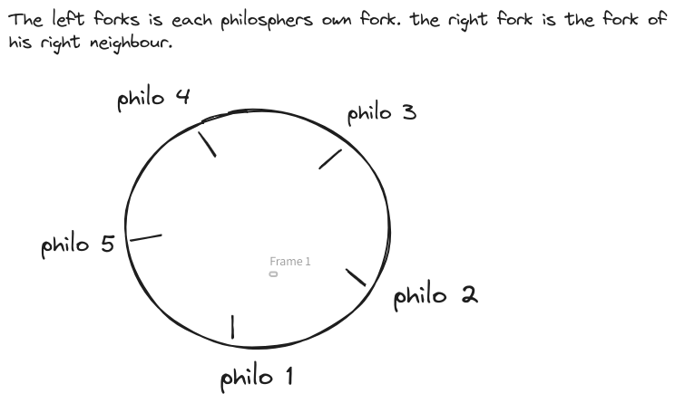

# Philosophers

- [Philosophers](#philosophers)
    - [Introduction](#introduction)
    - [Instructions](#instructions)
    - [Theory](#theory)
    - [Data races](#data-races)
    - [Deadlocks](#deadlocks)
    - [Mutexes](#mutexes)
    - [Atomic operations](#atomic-operations)
    - [Destroying mutexes](#destroying-mutexes)
    - [General Notes](#general-notes)
    - [Ending Threads and freeing rescources](#ending-threads-and-freeing-rescources)
    - [Steps of the program](#steps-of-the-program)
    - [Monitor thread vs monitoring state by each Tread](#monitor-thread-vs-monitoring-state-by-each-tread)
    - [Difference between pthread\_detach and pthread\_join](#difference-between-pthread_detach-and-pthread_join)
    - [Functions](#functions)

### Introduction
This project is the [42](https://42.fr/en/homepage/) implementation of the Dining Philosophers problem. A classic example of a multi-process synchronization problem, first proposed by Edsger Dijkstra in 1965. It is a representation of a scenario involving concurrent processes (threads) and the need for them to access shared resources in a manner that avoids deadlocks or [Data races](#data-races) 

The challenge is to come up with a protocol that allows each philosopher to periodically eat without causing a deadlock. A deadlock could occur if each philosopher picks up the fork on their right (or left) at the same time, leaving them all waiting indefinitely for the other fork to become available. The problem illustrates the challenges of allocating shared resources in a concurrent system in a way that avoids deadlock and starvation (where a philosopher never gets to eat).


### Instructions 
Here are the things you need to know if you want to succeed this assignment:
- One or more philosophers sit at a round table.
  There is a large bowl of spaghetti in the middle of the table.
- The philosophers alternatively eat, think, or sleep.
  While they are eating, they are not thinking nor sleeping;
  while thinking, they are not eating nor sleeping;
  and, of course, while sleeping, they are not eating nor thinking.
- There are also forks on the table. There are as many forks as philosophers.
- Because serving and eating spaghetti with only one fork is very inconvenient, a
  philosopher takes their right and their left forks to eat, one in each hand.
- When a philosopher has finished eating, they put their forks back on the table and
  start sleeping. Once awake, they start thinking again. The simulation stops when
  a philosopher dies of starvation.
- Every philosopher needs to eat and should never starve.
- Philosophers don’t speak with each other.
- Philosophers don’t know if another philosopher is about to die.
- No need to say that philosophers should avoid dying!

### Theory
The minimum theoretical possible time to die is 2 x time to eat for even number of philosophers and 3 x time to eat for uneven number philosophers except the lone philosopher case. To ensure the system is fair and philosphers are not snatching forks away right after eating, a thinking period is implemented, if eating time 




### Data races
A data race occurs, when two or more threads are accessing the same variable in a not thread safe manner and at least one of the threads is perfoming a write operation. This can lead to inaccurate or completely messed up values, since the variable can be in the writing process while its being read.
To avoid this, we need some way of synchronizing the threads for critical parts of our program (the read and write parts) like mutexes or semaphores.
A data race occurs when two or more threads access the same memory location concurrently, and at least one of the accesses is for writing, and the threads are not using any mechanism to synchronize their accesses to that memory. This can lead to inconsistent and unpredictable results. Mutexes help us avoid this problem by ensuring that only one thread can access the shared data at a time.

### Deadlocks
A deadlock can occur when a thread is blocked by another thread. In our philospher program the forks are mutexes 

### Mutexes
To avoid data races, we need we use mutexes. Mutex stands for mutual exclusion.
Lets say, we have one thread, that writes into a shared variable and another thread that reads this variable.
Before a thread can read or write, it needs to aquire (lock) the mutex. A mutex can only be locked by one thread. Another thread, that is trying to lock the same mutex will be blocked until it can lock the mutex. 


### Atomic operations
It is not enough, to check a value, for example if the simulation should end in a threadsafe manner, and then afterwards do some operation like eating or sleeping. This is because after we checked the value and before executing the action, the value can have changed. For this reason we need to perform the whole action within the locked mutex or mutexes if we need to check several values for our condition, like if the philosopher is still alive and the simulation should still run. Atomic operations are crucial to prevent race conditions.

### Destroying mutexes

### General Notes
- Be careful with `pthread_detach` function and be 100% sure that the detached Thread is not using any variables that might be altered by the main thread or that you use some form of synchronization. For example can the philosopher threads end and then the main thread free resources, which are still used by a still running detached thread.

### Ending Threads and freeing rescources
Initialization of mutexes allocates Memory dynamically.
Therefore, if we dont need the mutex any more or, when the program ends, we need to free, in this case destroy it using the pthread_mutex_destroy function.
Destroying a locked mutex can result in undefined behaviour. We have to unlock it first.

### Steps of the program
1. first we check for invalid input. Input can only be integers. Max Philo count = 200, min philo count = 1, min time time to eat, time to die, time to sleep = 60 ms.
2. Initialization of table struct 
3. Creation of fork and philo arrays
4. Initialization of fork and philo structs
5. 

### Monitor thread vs monitoring state by each Tread

### Difference between pthread_detach and pthread_join
Both `pthread_join` and `pthread_detach` are used to clean up resources after a thread has finished, but they work in different ways.

`pthread_join` blocks the calling thread until the thread with the specified ID has finished. This means that the calling thread is paused and doesn't resume execution until the joined thread is done. Additionally, `pthread_join` allows the calling thread to retrieve the exit status of the joined thread, if it's provided.

On the other hand, `pthread_detach` doesn't cause the calling thread to wait. Instead, it marks the specified thread as detached. Once a detached thread finishes execution, its resources are automatically reclaimed by the system. However, the exit status of a detached thread cannot be retrieved.

It's important to note that a thread should either be joined or detached to ensure all resources are properly cleaned up. If a thread is not explicitly detached or joined, and it finishes execution, it will remain in a "zombie" state, and some of its resources may not be reclaimed by the system.

### Functions
Before we start, we should look at the Functions, we are allowed to use, so we can better plan the structure of our program.

`memset`: Used to fill a block of memory with a particular value. It's commonly employed for initializing arrays or resetting memory regions.  
```c
void *memset(void *s, int c, size_t n);
```

`printf`: A standard output function in C used for formatted printing. Allows developers to print data to the console with specified formats, such as integers, floats, or strings.  
```c
int printf(const char *format, ...);
```

`malloc`: Memory allocation function in C used to dynamically allocate a specified number of bytes. Returns a pointer to the beginning of the allocated memory.  
```c
void *malloc(size_t size);
```

`free`: Function in C used to deallocate memory that was previously allocated using functions like `malloc`. Helps prevent memory leaks by releasing unused memory.  
```c
void free(void *ptr);
```

`write`: System call in Unix-like operating systems used to write data to a file descriptor, such as standard output (STDOUT). Often used for low-level file and I/O operations.  
```c
ssize_t write(int fd, const void *buf, size_t count);
```

`usleep`: Function in C that suspends the execution of a program for a specified number of microseconds. Often used for creating delays or controlling the timing of certain operations.  
```c
int usleep(useconds_t usec);
```

`gettimeofday`: System call in Unix-like operating systems that retrieves the current time, including the seconds and microseconds since the epoch. Commonly used for measuring time intervals. The second argument is now obsolete.  
```c
int gettimeofday(struct timeval *tv, struct timezone *tz);
```

`pthread_create`: Function in the POSIX threads library (`pthread`) used to create a new thread. Takes a thread ID, attributes, a start routine, and optional arguments for the new thread.  
```c
int pthread_create(pthread_t *thread, const pthread_attr_t *attr, void *(*start_routine)(void *), void *arg);
```

`pthread_detach`: Function in the `pthread` library that marks a thread as detached. This means that the system will automatically reclaim the resources when the thread terminates.  
```c
int pthread_detach(pthread_t thread);
```

`pthread_join`: Function in the `pthread` library used to wait for a thread to terminate. Suspends the execution of the calling thread until the specified thread completes.  
```c
int pthread_join(pthread_t thread, void **retval);
```

`pthread_mutex_init`: Function in the `pthread` library used to initialize a mutex (short for mutual exclusion). Mutexes are often used for synchronizing access to shared resources in multithreaded programs.  
```c
int pthread_mutex_init(pthread_mutex_t *mutex, const pthread_mutexattr_t *attr);
```

`pthread_mutex_destroy`: Function in the `pthread` library used to destroy a previously initialized mutex. Releases any resources associated with the mutex.  
```c
int pthread_mutex_destroy(pthread_mutex_t *mutex);
```

`pthread_mutex_lock`: Function in the `pthread` library used to acquire a lock on a mutex. Ensures exclusive access to a shared resource by the calling thread.  
```c
int pthread_mutex_lock(pthread_mutex_t *mutex);
```

`pthread_mutex_unlock`: Function in the `pthread` library used to release a lock on a mutex. Allows other threads to acquire the lock and access the shared resource.  
```c
int pthread_mutex_unlock(pthread_mutex_t *mutex);
```